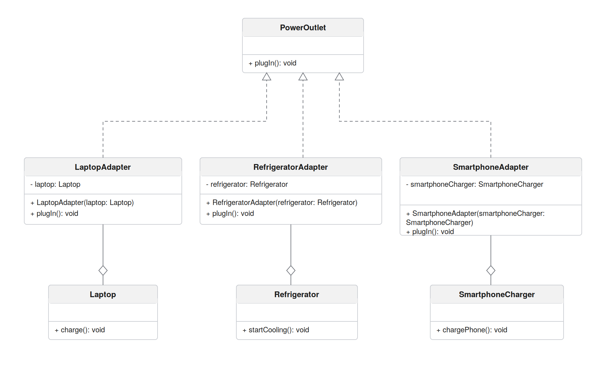

# Overview

This project applies the Adapter design pattern to a scenario involving multiple household and personal devices that all need to draw power from a wall outlet. In real life, not every device shares the same plug type, voltage, or amperage requirement, which means they can't all be connected the same way. Rather than redesigning each device to fit one universal plug, this application solves the problem in software by introducing an adapter layer between the devices and a single, standard interface.

The idea mirrors how physical power adapters work: instead of changing the device itself, you plug an adapter into the outlet, and the adapter handles translating the outlet's power into something the device can actually use. In this implementation, three devices are used as examples: a laptop, a refrigerator, and a smartphone charger. Each of these already has its own way of "starting up," but none of them speaks the same language as the PowerOutlet interface. The three adapter classes exist to bridge that gap, so that from the client's point of view, plugging in any device looks exactly the same, regardless of what's actually happening underneath.

Adaptee Objects:

Laptop - a device that runs on battery power and needs charging. Its own method for this is charge().

Refrigerator - a device that must stay powered continuously to keep running. Its own method for this is startCooling().

SmartphoneCharger - a device used to power up a phone. Its own method for this is chargePhone().

Target Object:

PowerOutlet - the shared interface all devices are expected to connect through. It exposes one method, plugIn(), that every adapter must implement. This is the only method the client (ApplianceApp) ever calls, regardless of which device is actually plugged in.

Adapter Objects:

LaptopAdapter - sits between a Laptop and the PowerOutlet interface, forwarding plugIn() calls to charge().

RefrigeratorAdapter - sits between a Refrigerator and the PowerOutlet interface, forwarding plugIn() calls to startCooling().

SmartphoneAdapter - sits between a SmartphoneCharger and the PowerOutlet interface, forwarding plugIn() calls to chargePhone().

# Class Diagram

